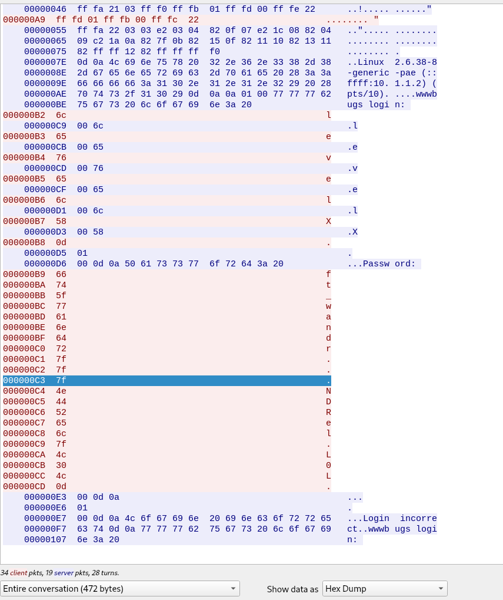

# Level02 – SnowCrash

## Objective
Recover credentials transmitted over the network by analyzing an intercepted Telnet session and obtain the flag.

## Reconnaissance
Identified a packet capture file owned by `flag02`:
```bash
ls -la
----r--r-- 1 flag02 level02 8302 Aug 30 2015 level02.pcap
```
The file `level02.pcap` contains captured network traffic for analysis.

## Exploitation
### Transfer the capture file
Transferred the `.pcap` file to the local machine for analysis:
```bash
scp -P 4243 level02@10.14.14.4:/home/user/level02/level02.pcap ~/Downloads/
```
### Traffic Analysis
- Opened the capture in Wireshark.
- Filtered and followed the TCP stream of the Telnet session.
- Extracted credentials transmitted in cleartext.
- The password contained control characters (`0x7f`, DEL – backspace), which were removed to reconstruct the correct password.


## Flag

